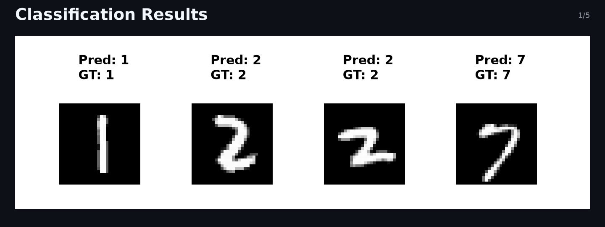

# PyTorch digit recognizer

Implementing from scratch a CNN for digit recognition.

### Clone 

```bash
git clone https://github.com/paluks/mnist_from_scratch 
```

### Train

```bash
python train.py
```

### Classification Results

> Classification results on the MNIST test set

<p align="center">
  
</p>